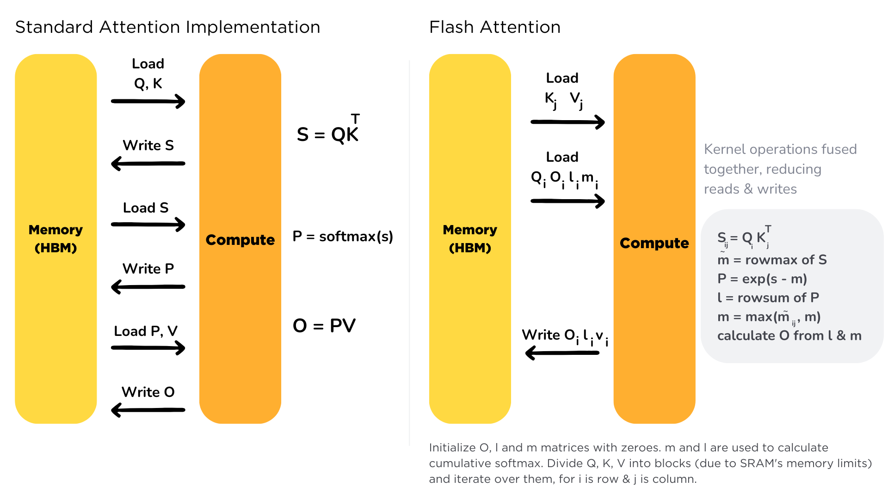
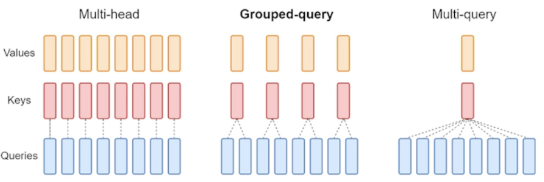

# GPT2 to llama 3

## video outline

- create gpt model
  - MLP 
  - transformer 
- forward pass
- tokenization
- inference
- data loader
- weight initialization
- optimization
  - mixed precision
  - bf16
  - torch.compile
  - flash attention
  - parameter dividable by 8
- optimizer
  - learning rate schedule (warmup + decay)
  - AdamW

## Experiment on speed up 

- https://huggingface.co/docs/transformers/main/en/llm_tutorial_optimization#2-flash-attention

- methods
  1. original
     - torch.compile, parameter dividable by 8
  2. +BF16
     - Colab gpu (L4) is not naively support bf16 
     - https://pytorch.org/xla/release/2.3/index.html
  3. +Flash attention
  4. +KV cache
  5. +Grouped Query Attention 

- metrics
  - token per second

## Experiment on accuracy
  1. original with all the speed up
  2. +RoPE (Rotary Positional Encoding)
  3. +RMS (Root Mean Squared Normalization)
  4. +SwiGLU Activation Function

- [LLama 3 archi explain](https://medium.com/@vi.ai_/exploring-and-building-the-llama-3-architecture-a-deep-dive-into-components-coding-and-43d4097cfbbb) 

- TODO later: 
  - KV cache
    - https://pytorch.org/torchtune/stable/_modules/torchtune/modules/kv_cache.html
  - Grouped Query Attention
    - https://pytorch.org/torchtune/stable/_modules/torchtune/modules/attention.html
    - https://arxiv.org/pdf/2305.13245
  - RoPE (Rotary Positional Encoding)
  - RMS (Root Mean Squared Normalization)
  - SwiGLU Activation Function

## Problem

## GPU Requirement

- Model
  - parameters: 117M
  

- L4
  - VRAM: 24GB
    - model parameters: 117M * 2 
  - GPU memory bandwidth: 300GB/s
  - BF16/FP16: 242 teraFLOPS
  - kv cache size: 
    ```
    = (2 * 2 * n_layers * d_model) bytes/token
    = (4 * 32 * 4096) bytes/token
    = 524288 bytes/token
    ~ 0.00052 GB/token
    
    kv_cache_tokens
    = memory left after loading the model / 0.00052 GB/token
    = 19,230 tokens
    ```

## Notes

- Q: Why use K, Q, V in transformer?
  - https://jalammar.github.io/illustrated-transformer/
  - Q: representation of the current token
  - K: representation of the context (all tokens)
  - V: representation of the actual content of the tokens
  - softmax(Q @ K)/sqrt(dim of K): attention score
  - attention @ V: weighted sum of V

- Flash attention 2
  - To avoid memory bottleneck, avoid memory IO
  - It loads k,q,v once, fuses the operations of the attention mechanism, and writes them back
  -

- Q: Why the dim of the inner FFN is the 4x of the input and output dim of the n_embd?
  - It allows the FFN to learn more complex mappings and capture higher-order interactions.

- Grouped Query Attention
  - all with KV cache
  - multi-head attention -> high quality, more compute
  - multi-query attention -> less quality less compute
    - MQA uses only a single key-value head for multiple queries
  - Grouped Query Attention -> middle group
    - GQA uses multi head for grouped queries while maintaining multi k&V heads -> reduce # of k/v heads


- Q: Why LayerNorm over BatchNorm in transformer
  - LayerNorm: Norm across feature dimension
  - BatchNorm: Norm across batch dimension
    - cons vs LayerNorm:
      - affect by small batch size and specific inputs
      - need to store running mean and std
      - difference between training and inference

- SwiGLU activation function
  - x times sigmoid function with beta=1
  - it perform good but dont know why

  - ```markdown
    We offer no explanation as to why these architectures seem to work; we attribute their success, as all else, to divine benevolence.
    ```

- RMS Norm
  - authors assumed the success of LayerNorm is based on scaling, not centering -> remove centering in norm layer
    - pros: less compute
  - scaling by Root Mean Square, and times a learnable vector

- operations per byte
  - ```
    = compute_bw / memory_bw 
    ```
  - fewer than = memory bound
  - more than = compute bound